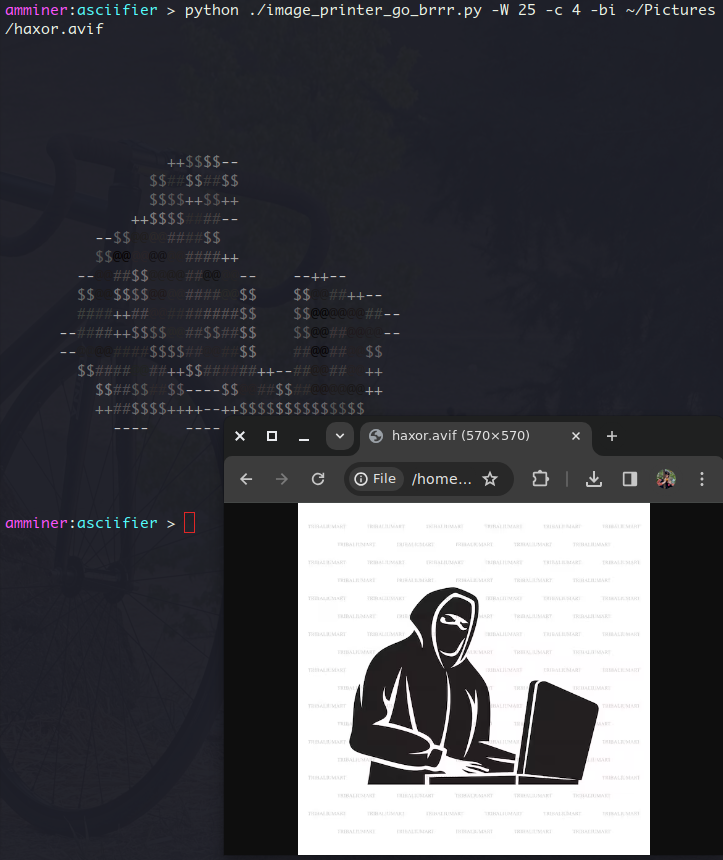
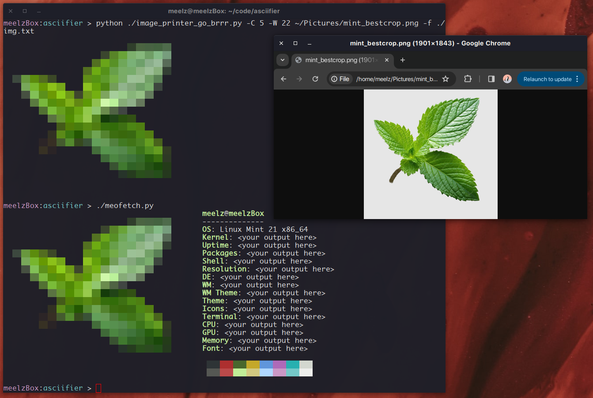

# ASCIIFIER

The main script (named image_printer_go_brrr.py, which I really should have changed before posting to github)
reads an image file into memory and parses it into colored text using ansi escapes,
then dumps it to stdout. I find this really fun, and sometimes even useful.

I hope to eventually evolve it into something that could be easily consumed
by other code, maybe being used in the context of something with a terminal
UI (curses, perhaps?). I also have at least one good idea for how I would
integrate this into a broader program of my own design.

It uses a handful of switches to provide highly configurable output when called
as the main module from the terminal. Check out the -h flag!

I've only tested this on Linux in gnome-terminal under X11 (works great) and on Windows 10
in msys2/git bash (works not so great), but I have had a friend
clone it and run it in powershell and cmd on Windows 11 with reasonable results.
None of the windows-based terminals I've seen it run on don't seem to behave as well with
animated gifs. I intend to resolve this before extending the core function of the image printer
script any further - see the issues tab on github.

Anyway, here it is in action!

https://github.com/amminer/asciifier/assets/107884857/33ef3ec5-64a6-40ec-bee2-bff622b389b2

(🎶 - Lightsleeper by Windows 96)

I'm using a github-issues-first approach to manage work on this project - when you or I
notice that something is wrong or would like to see a feature implemented, ideally an
issue is created, and after any needed discussion that issue gets translated into a
ticket on the project's [kanban board](https://github.com/users/amminer/projects/1).

Once I'm satisfied with the state of the code and its functionality I will stop pushing
straight to main, I swear! Feature and bug branches coming soon. :)

## Some examples of the script's utility:

* Easily generate little graphics for notes you're taking:

  

  ```
  ...
  metasploit of course:

                 ++$$$$--
                $$##$$##$
                $$ > <  +
              ++$$  ω  #-
          --$$@@@@#   $$
          $$@@@@@@@@####++
        --@@##$$@@@@##@@@@--    --++--
        $$@@$$$$ get pwnd $     $$@@##++--
        ####++##@@# lol #$$     $$@@@@@@##
      --####++$$$$@@##$$##$$    $$@@##@@@@
      --@@@@####$$$$##@@##$$    ##@@##@@$$
        $$####@@##++$$######++--##@@##@@++
          $$##$$##$$----$$@@##$$##@@@@@@++ ___
          ++##$$$$++++--++$$$$$$$$$$$$$$   __ |
            ----    ----                    | |
                                            | |          INTERFACES
           |````````````````````````````````` |          ___________
           | |`````````````````````````````````         | console   |
           | |                        LIBRARIES         |           |
           | |                        __________        | cli       |
           | |_______ TOOLS ======== | rex      |       |           |
           L_________                |          |       | web       |
                      PLUGINS ====== | msfcore  | ===== |           |
                                     |          |       | gui       |
                                     | msf base |       |           |
                                     ````````````       | armitage  |
                             modules      ||            `````````````
                       ___________________________________________________
                      |                                                   |
                      | payloads  exploits  encoders  post-mods auxiliary |
                      |                                                   |
                      `````````````````````````````````````````````````````

  There's also Cobalt Strike -
  ...
  ```

* Make neofetch less ugly (especially on Linux Mint):

  

